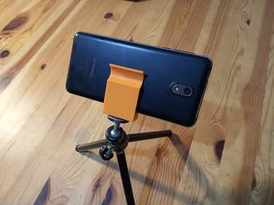

# phone-holder

Cell phone holder design using OpenSCAD.

SCAD code design for a cell phone holder (phone width ~8mm).

[ Recuires a 1/4" nut to connect to a universal camera mount ]

OpenSCAD: http://www.openscad.org/

